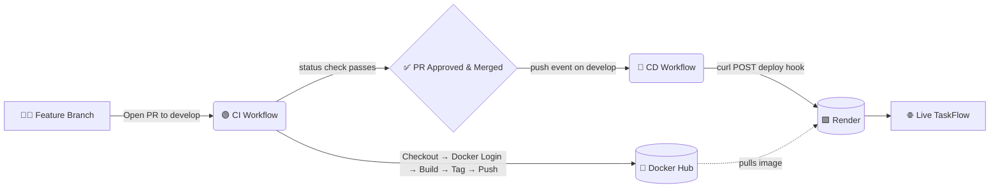

<div align="center">

# 🗂️ TaskFlow

### A lightweight, containerized task-management web app — shipped with a full GitHub Actions CI/CD pipeline.

<br/>

[](https://github.com/OttomanZ/taskflow-cicd/actions/workflows/ci.yml)
[](https://github.com/OttomanZ/taskflow-cicd/actions/workflows/cd.yml)
[](#-license)

<br/>


</div>

---

## 📖 Overview

**TaskFlow** is a five-page task-management application built for **DevOps Fundamentals — Assignment 04 (Spring 2026)**. The focus of the project is the **CI/CD pipeline**: every change flows from a feature branch, through an automated Continuous Integration build that packages the app as a Docker image, and on to an automated Continuous Deployment that ships it live to Render.

> **Flow at a glance:** `Feature Branch` → `Pull Request` → 🟢 **CI builds & pushes Docker image** → `Merge to develop` → 🚀 **CD deploys to Render** → ✨ Live TaskFlow updated

---

## ✨ Features

| Page | File | What it does |
| :--- | :--- | :--- |
| 🏠 **Home / Dashboard** | `index.html` | Summary counts (total / pending / completed), welcome message, and quick navigation. |
| ➕ **Add Task** | `add-task.html` | Form to create a task — title, description, due date, and priority. |
| 📋 **Task List** | `task-list.html` | Table of all tasks with All / Pending / Completed filters. |
| 🔍 **Task Detail** | `task-detail.html` | Full details of one task, with mark-complete and delete actions. |
| ℹ️ **About / Help** | `about.html` | Description of the app and a simple usage guide. |

All pages share a single **`style.css`** for a consistent look and feel.

---

## 🏗️ Architecture



---

## 🧰 Tech Stack

- **Frontend:** Static HTML5 + CSS3 (no build step, instant load)
- **Container:** Docker, served by **Nginx (alpine)**
- **CI/CD:** GitHub Actions (two chained workflows)
- **Registry:** Docker Hub
- **Hosting:** Render (Docker-based Web Service, triggered by deploy hook)

---

## 📁 Repository Structure

```
taskflow-cicd/
├── index.html                 # Home / Dashboard
├── add-task.html              # Add Task
├── task-list.html             # Task List
├── task-detail.html           # Task Detail
├── about.html                 # About / Help
├── style.css                  # Shared stylesheet
├── Dockerfile                 # nginx-based container definition
├── Assignment_04_Spring2026.docx   # Versioned assignment paper
└── .github/
    └── workflows/
        ├── ci.yml             # CI — build & push image (on PR → develop)
        └── cd.yml             # CD — deploy to Render (on push → develop)
```

---

## 🔄 CI/CD Pipeline

### 🟢 Continuous Integration — `.github/workflows/ci.yml`
**Trigger:** `pull_request` targeting `develop`.

| Step | Action |
| :--- | :--- |
| 1️⃣ Checkout | `actions/checkout` |
| 2️⃣ Docker Login | Authenticate to Docker Hub with repo secrets |
| 3️⃣ Build | Build image from the `Dockerfile` |
| 4️⃣ Tag | `latest` **and** short commit SHA |
| 5️⃣ Push | Push tagged image to Docker Hub |

The run **fails fast** on any step error, so a broken image never reaches deployment.

### 🚀 Continuous Deployment — `.github/workflows/cd.yml`
**Trigger:** `push` to `develop` (i.e. when a PR is merged).

| Step | Action |
| :--- | :--- |
| 1️⃣ Checkout | `actions/checkout` |
| 2️⃣ Environment | Declares `environment: development` to access the deploy-hook secret |
| 3️⃣ Deploy | `curl -X POST` to the Render deploy hook |
| 4️⃣ Confirm | Prints a timestamped deployment confirmation |

> The CD job contains **no** Docker build/push steps — that responsibility belongs solely to CI.

---

## 🔐 Environment & Secrets

Configured by the **Team Lead** (repository admin). Secret **values are never committed** — they live only in encrypted GitHub Secrets.

| Scope | Secret | Description |
| :--- | :--- | :--- |
| Repository | `DOCKERHUB_USERNAME` | Team Lead's Docker Hub username |
| Repository | `DOCKERHUB_TOKEN` | Team Lead's Docker Hub access token (PAT) |
| Environment → `development` | `RENDER_DEPLOY_HOOK_URL` | Deploy-hook URL of the Render web service |

---

## 🚀 Run Locally

```bash
# Clone
git clone https://github.com/OttomanZ/taskflow-cicd.git
cd taskflow-cicd

# Build & run with Docker
docker build -t taskflow-cicd .
docker run -d -p 8080:80 taskflow-cicd

# Open http://localhost:8080
```

---

## 🌿 Branching & Contribution Flow

Each member works on a dedicated feature branch and opens a PR into `develop`:

```bash
git checkout develop
git checkout -b feature/<your-username>/<page-name>
# ...build your page, link it to style.css...
git add <page>.html
git commit -m "Add <page> page"
git push -u origin feature/<your-username>/<page-name>
# Open a Pull Request targeting develop → CI runs automatically
```

`develop` is protected: a passing **CI** check and **one review** are required before the Team Lead merges.

---

## 👥 Team

| Role | Name | GitHub |
| :--- | :--- | :--- |
| 👑 Team Lead | Muneeb Ahmad | [@OttomanZ](https://github.com/OttomanZ) |
| 👨‍💻 Member | Hassan Iftikhar | [@hassan-iftikhar-dev](https://github.com/hassan-iftikhar-dev) |
| 👨‍💻 Member | Umer Aziz | [@umeraziz-dev](https://github.com/umeraziz-dev) |
| 👨‍💻 Member | Rashid Shokat | [@rashidshokat77-collab](https://github.com/rashidshokat77-collab) |
| 👨‍💻 Member | Umar Hassan | [@umer-hassan-de](https://github.com/umer-hassan-de) |

---

## 📄 License

Released under the **MIT License**. See below.

<div align="center">

---

Made with ☕ and 🐳 for **DevOps Fundamentals · Spring 2026**

</div>

<!-- Full application image: all 5 pages present on develop. -->
